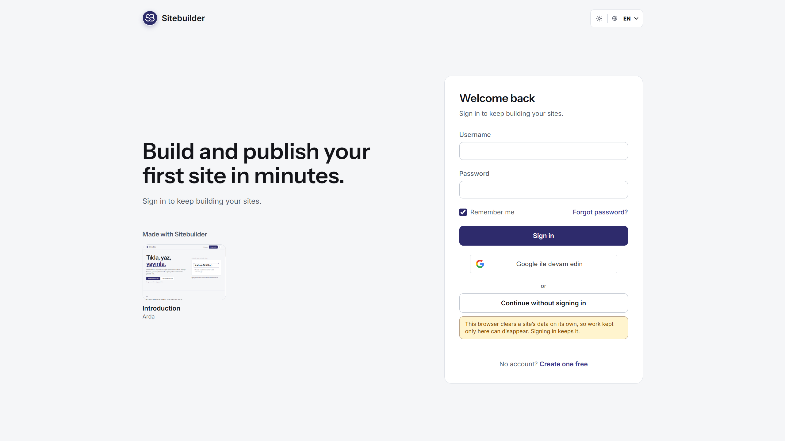
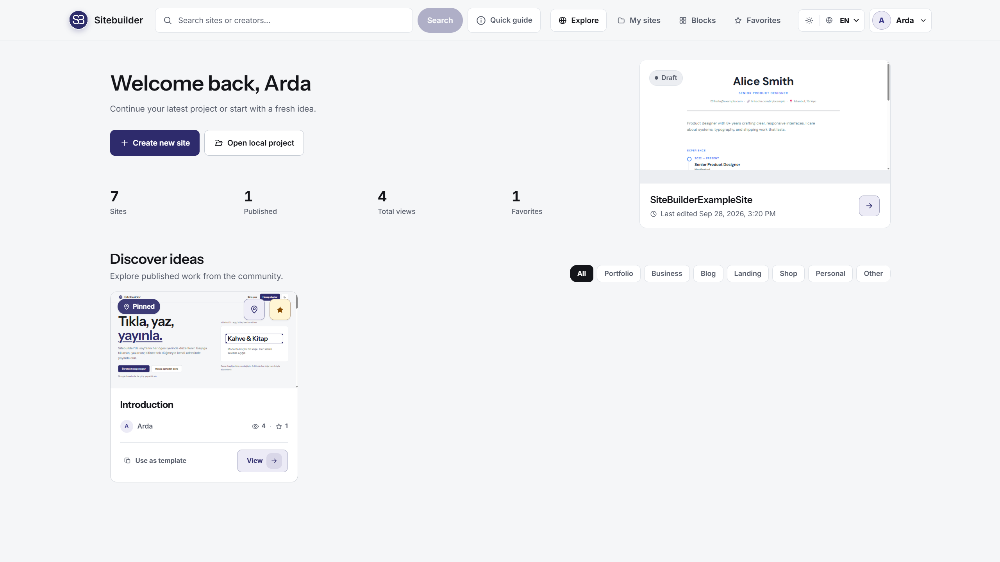
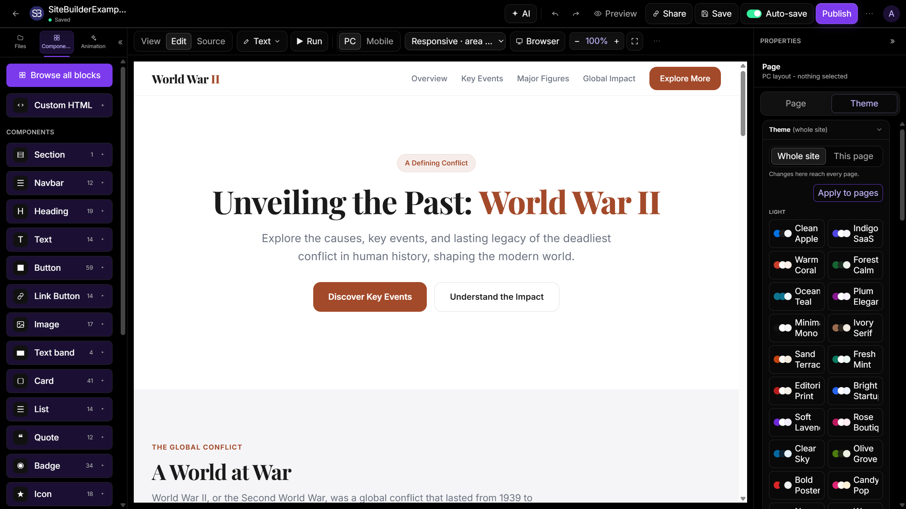
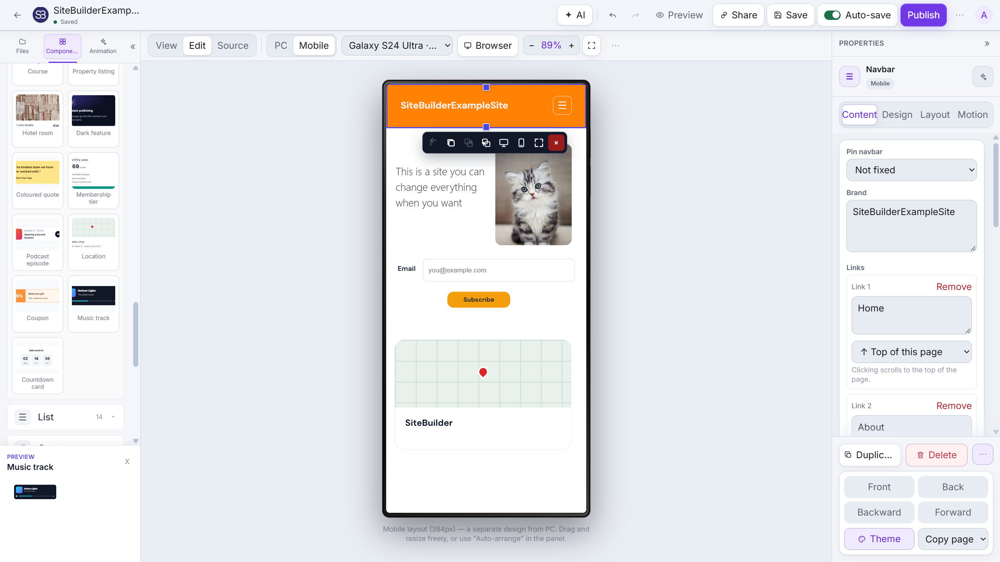
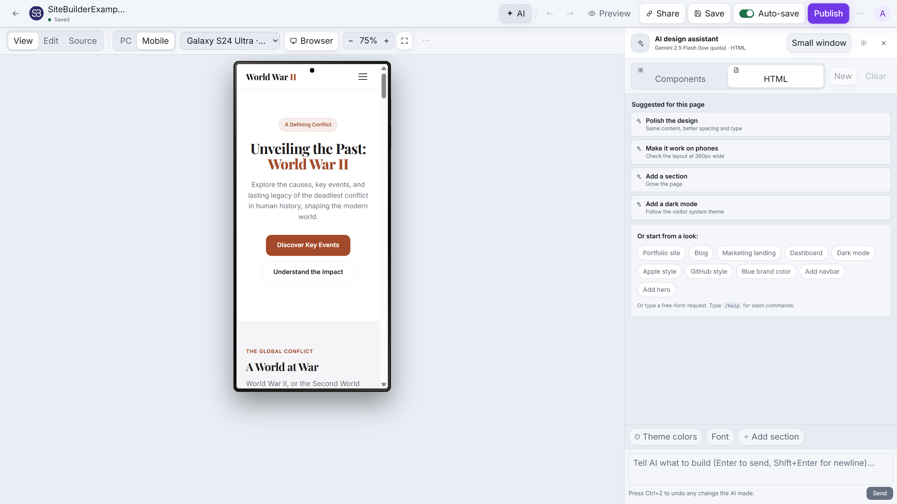
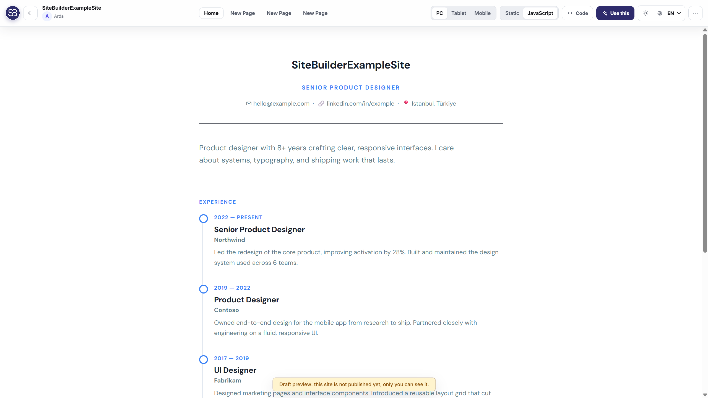
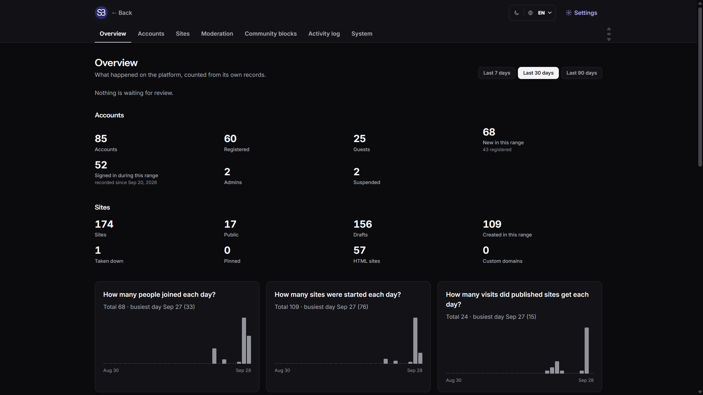

<!-- Use align="left" on the image to prevent table borders -->


<!-- Use <h3> (###) instead of <h1> (#) to avoid GitHub's default bottom border -->
<br>
<br>

### SiteBuilder

<!-- Short description right next to the logo -->

<!-- Clear the alignment so the rest of your README continues normally below -->
<br clear="left"/>

<!-- Add a line break to clear the alignment for subsequent content -->
<br clear="left"/>

A  site builder with two editing paths:

- Build from ready-made components on a free canvas, then tune desktop/mobile
  layouts independently.
- Import an existing HTML project directly in the editor. Uploaded HTML is kept
  as real HTML, with matching CSS/JS/assets inlined when they are uploaded
  together, so view mode can run the page's JavaScript in an isolated sandbox.

Imported HTML sites can be viewed, lightly edited in-place, tested against common
desktop/tablet/phone viewport presets, saved as drafts, and published to a public
URL.

## Screenshots


<br>

<br>

<br>

<br>

<br>

<br>


## Tech stack

- **Frontend:** React (Vite, JavaScript), Tailwind CSS, Zustand, @dnd-kit, React Router, axios
- **Backend:** Django + Django REST Framework, token auth, SQLite (JSON schema storage)

## Run the project

**One command (Windows).** From the project root, double-click `start.bat` (or run
it in a terminal). On the first run it creates the Python virtualenv, installs the
backend + frontend dependencies, applies migrations, starts both servers, and opens
the browser.

```powershell
.\start.bat
```

If PowerShell blocks the script, run it explicitly:

```powershell
powershell -ExecutionPolicy Bypass -File .\start.ps1
```

Then open http://localhost:5173 (backend runs on http://127.0.0.1:8001).

> The backend uses **8001**, not Django's usual 8000. 8000 is what every Django
> project defaults to, so on a machine running more than one the first to start
> takes the port and the others end up talking to the wrong API.

### Run manually

Backend:

```bash
cd backend
python -m venv .venv
.venv\Scripts\activate            # macOS/Linux: source .venv/bin/activate
pip install -r requirements.txt
python manage.py migrate
python manage.py runserver 127.0.0.1:8001   # http://127.0.0.1:8001
```

Frontend:

```bash
cd frontend
npm install
npm run dev                       # http://localhost:5173
```

### Tests

```bash
cd backend && pytest -q           # backend
cd frontend && npm run test:run   # frontend unit tests
cd frontend && npm run e2e        # end-to-end, in a real browser
```

The end-to-end suite (`frontend/e2e/`) starts the backend and Vite itself, or
uses them if they are already running, and signs up a fresh account for each
run. If `python` is not the backend's virtualenv, say which one:
`E2E_PYTHON=../backend/.venv/Scripts/python.exe npm run e2e`. The first time,
install its browser with `npx playwright install chromium`. CI runs all three
on every push.

## Going to production

The app runs the same code in dev and prod — production hardening (Postgres,
HTTPS/HSTS, CSP, rate limiting, and the local-AI proxy disabled outside DEBUG)
turns on automatically when `DJANGO_DEBUG=False`. See **[DEPLOY.md](DEPLOY.md)**
for the launch checklist (secrets, hosts, TLS, Redis for shared throttling) and
the deferred items (email password-reset, S3 media, JWT) with how to wire each.

## Settings page (no env edits needed)

A **superuser** can configure Google sign-in, reCAPTCHA, email/SMTP and the
frontend URL from inside the app — **Admin → Settings** (`/admin/settings`) — with
no env edits or restart. Saved values take effect immediately. Each field is
**optional and falls back to the matching env var** when left blank, so the
env-based setup below still works and you can mix the two. Secrets (reCAPTCHA
secret, SMTP password) are write-only: the page shows whether each is configured
but never displays the stored value, and saving with the field blank keeps it.

> Infrastructure that must exist before the app boots — `DJANGO_SECRET_KEY`,
> `DATABASE_URL`, `DJANGO_ALLOWED_HOSTS`, `DJANGO_DEBUG` — stays in env by design
> (it can't live in the database the app connects to). Grant superuser with
> `python manage.py createsuperuser` (or `is_superuser=True`).

## Optional: Google sign-in, reCAPTCHA & Admin (env method)

Google sign-in and the "I'm not a robot" check are **env-gated**: with no keys the
app runs exactly as before (the Google button and the captcha simply don't show).
Add the keys below to turn each on, then restart both servers. (Or just use the
**Settings page** above — same effect, no restart.)

### Google sign-in

1. Go to the **Google Cloud Console → APIs & Services → Credentials**
   (<https://console.cloud.google.com/apis/credentials>).
2. *Create credentials → OAuth client ID → Application type: **Web application***.
   (First time, you'll be asked to configure the OAuth consent screen — pick
   "External", fill the app name + your email, and save.)
3. Under **Authorized JavaScript origins** add your frontend origin(s):
   `http://localhost:5173` (and your production URL when you deploy). You do **not**
   need a redirect URI — this uses the Google Identity Services token flow.
4. Copy the **Client ID** (looks like `1234-abc.apps.googleusercontent.com`) and put
   the **same value** in two places:
   - `backend/.env` → `GOOGLE_OAUTH_CLIENT_ID=...`
   - `frontend/.env` → `VITE_GOOGLE_CLIENT_ID=...`
5. Restart the backend and `npm run dev`. A "Continue with Google" button now
   appears on the Login/Register pages. (The backend verifies the Google ID token
   with the `google-auth` package — already in `requirements.txt`.)

### reCAPTCHA (the "I'm not a robot" box)

1. Open the **reCAPTCHA admin** (<https://www.google.com/recaptcha/admin>).
2. Register a site → choose **reCAPTCHA v2 → "I'm not a robot" Checkbox** → add the
   domain `localhost` (and your production domain).
3. Copy the two keys into:
   - `frontend/.env` → `VITE_RECAPTCHA_SITE_KEY=<site key>`
   - `backend/.env` → `RECAPTCHA_SECRET_KEY=<secret key>`
4. Restart. The checkbox now appears on Register and is verified server-side.

> The CSP already allows the Google/gstatic domains these scripts load from.
> See `backend/.env.example` and `frontend/.env.example` for the exact variable names.

### Admin panel (moderation)

The in-app **Admin** link (top-right, next to Favorites) and `/admin` page are
shown only to **staff** accounts. The panel has two tabs: **Users & sites**
(suspend/reinstate a user, unpublish or delete any site) and **Reports** (the
moderation queue from visitors' "⚑ Report" on public sites — resolve, dismiss,
or take the site down). Promote your account once:

```bash
cd backend
.venv\Scripts\python.exe manage.py shell -c "from django.contrib.auth.models import User; User.objects.filter(username='YOURNAME').update(is_staff=True)"
```

(or create a full superuser with `python manage.py createsuperuser`, which can also
use Django's own admin at `/admin/` on the backend.)
